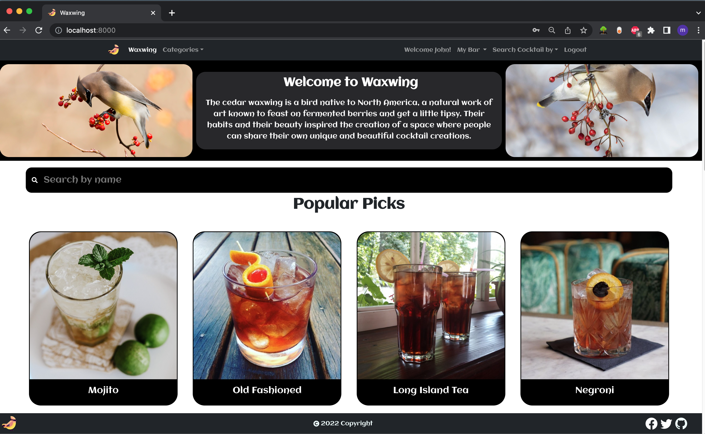
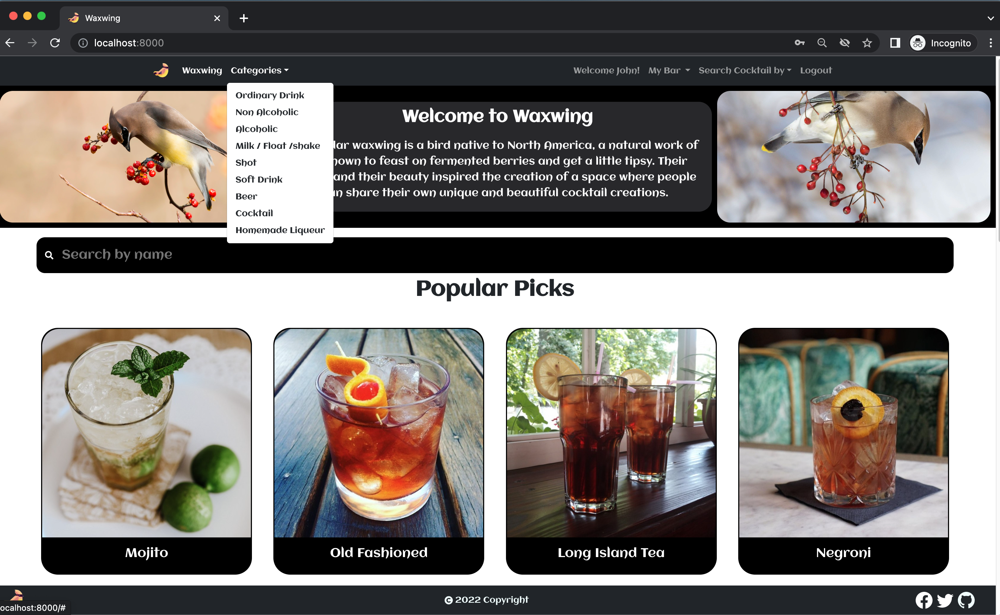
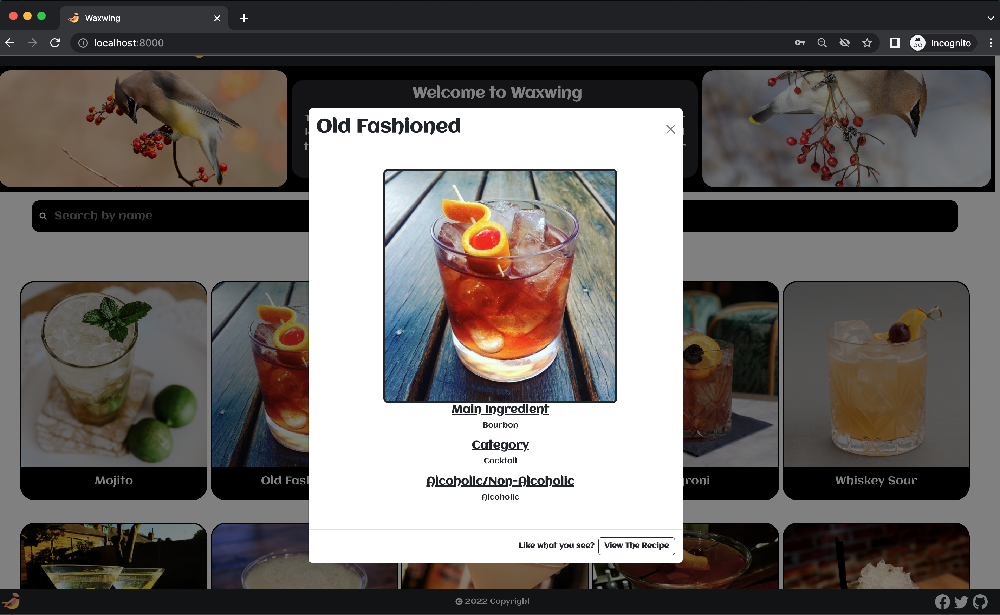

# Waxwing

This is a single page app that allows users to :

- search cocktal recipies by category (Alcoholic, Non-alcoholic , Shot ...)
- serach by name , fisrt letter and ingredients
- Add drinks to their favorite list
- Share drink recipes link
- Create their own cocktail recipe and image and video to it

# Tech Stack:

- Front-end : React, Bootstrap, Styled components, MaterialUi
- Back-end : PSQL , Express, Axios, Knex.js

## Setup

- Clone the repository
- Copy .env.example to .env in react-fron-end and express-back-end
- Add DataBase information, and TheCocktailDB.com API key

### DataBase Setup :

- cd to express-back-end folder
- `npm install `
- `psql -h <localhost> -p<5432> -U <labber> -d <nameOfYouDb> `
- `npm run migrate `
- `npm run seed `
- `npm start `

Front-end setup

- cd to react-fron-end folder
- `npm install `
- `npm start `

# Final Product

#### Home page

#### Categories

#### Search Coktail By

#### My Bar

#### Modal

#### Details page

#### Add new cocktail form

#### My cocktails page

